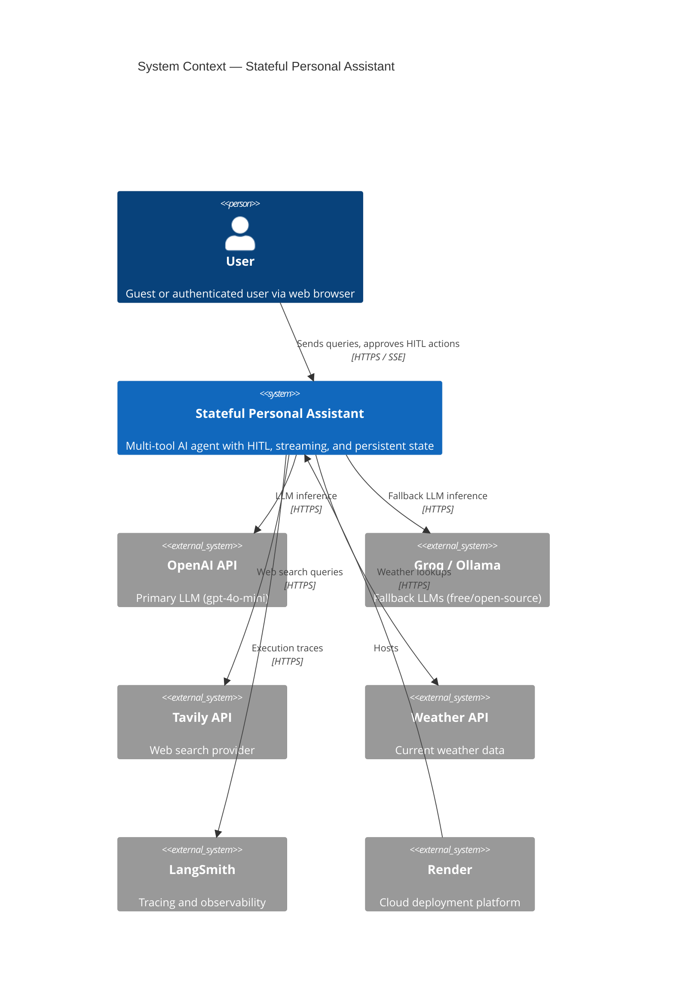
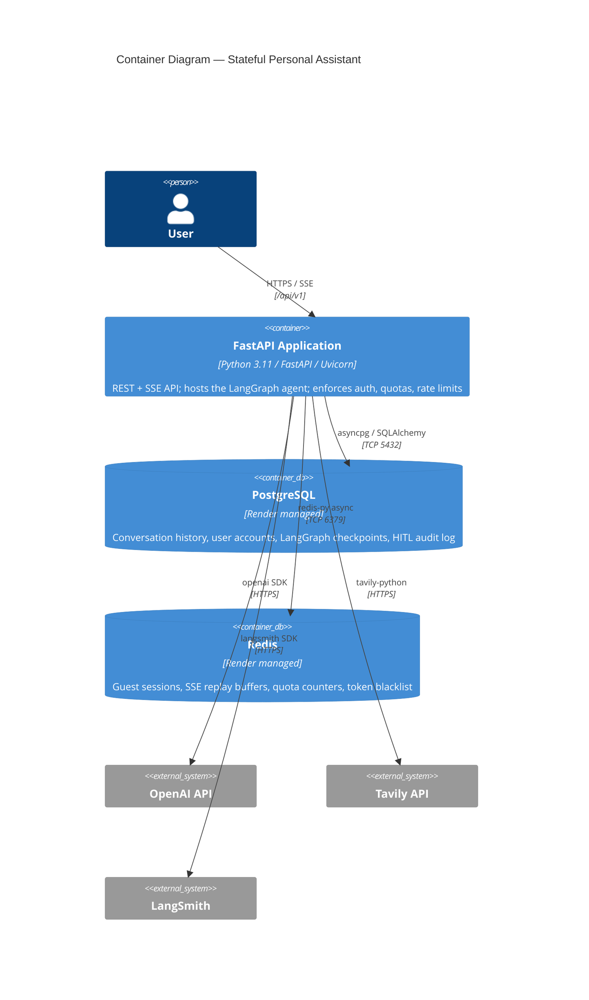
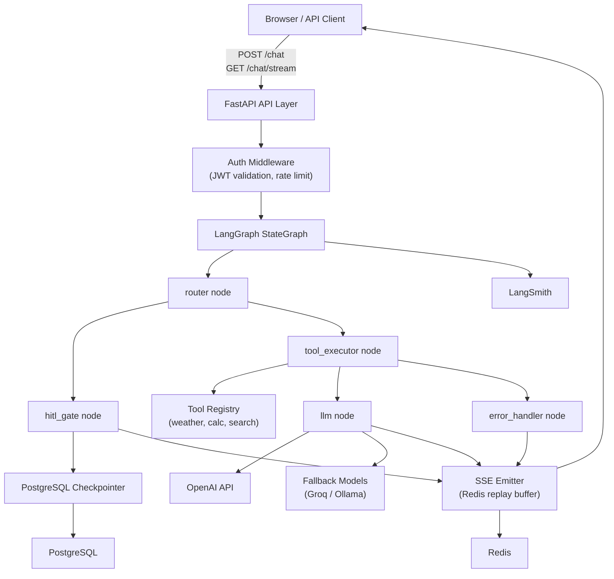
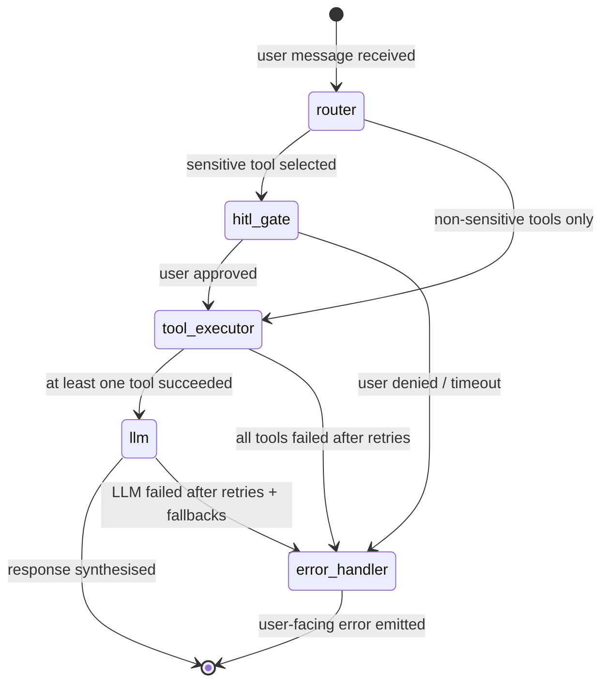
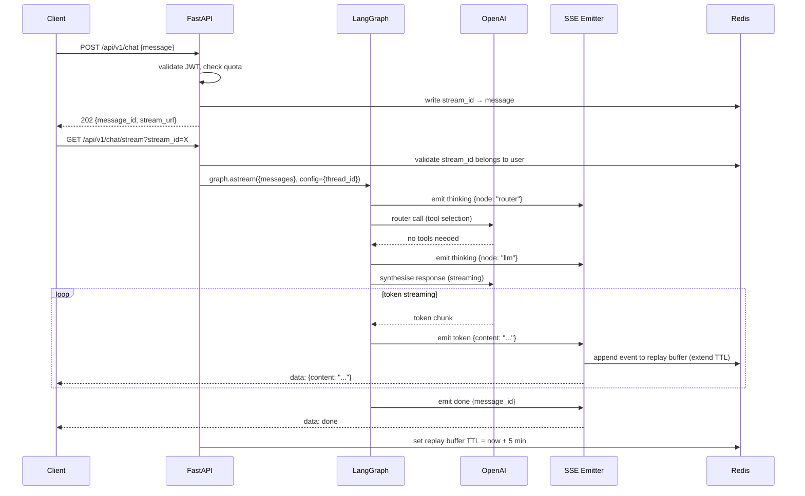
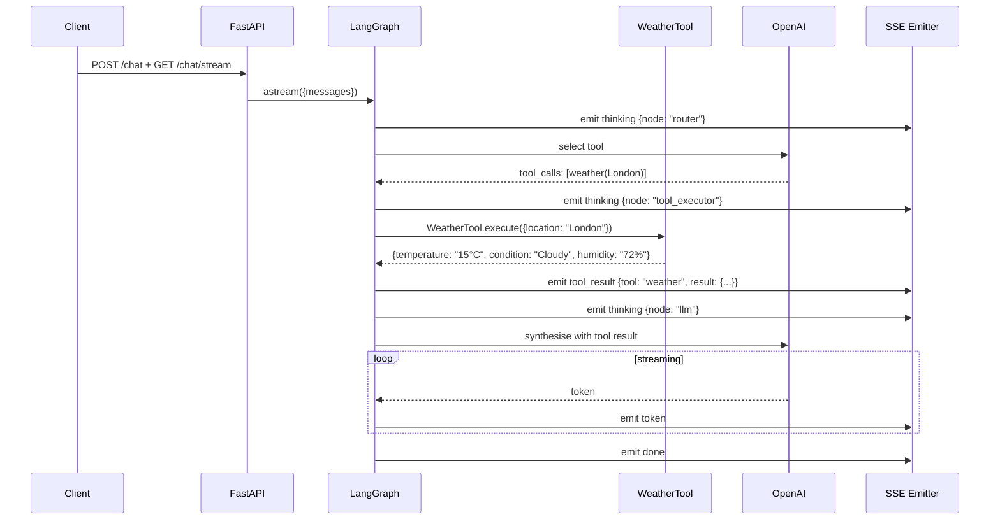
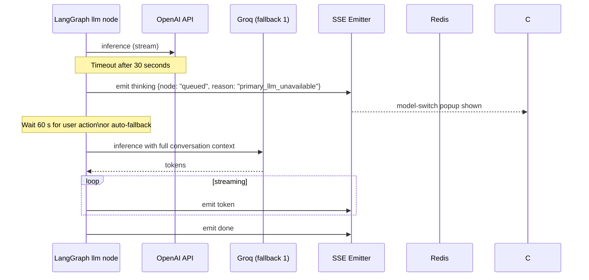
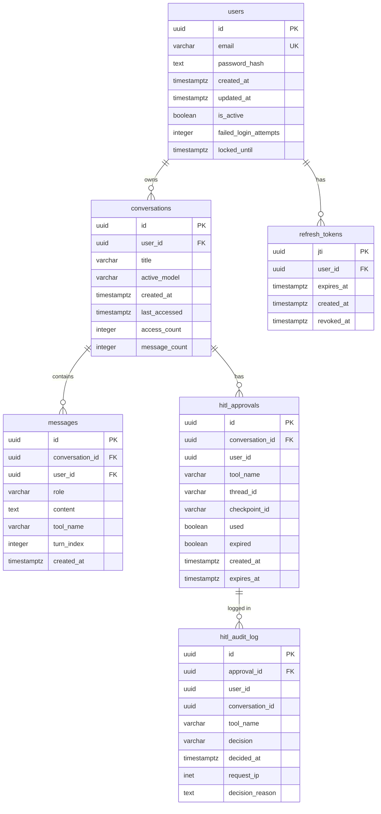

# System Design Document
## Stateful Personal Assistant — Multi-Tool AI Agent

| Field | Value |
|---|---|
| **Version** | 1.1 |
| **Date** | 2026-05-20 |
| **Status** | Draft |
| **Author** | Suman Jaiswal |
| **Spec version** | SPEC.md v1.1 |
| **Review addressed** | DESIGN_REVIEW.md — all CRITICAL + HIGH findings |

---

## Table of Contents

1. [High-Level Architecture](#1-high-level-architecture)
2. [Component Breakdown](#2-component-breakdown)
   - 2.1 [LangGraph StateGraph Design](#21-langgraph-stategraph-design)
   - 2.2 [State Schema](#22-state-schema)
   - 2.3 [Node Responsibilities](#23-node-responsibilities)
   - 2.4 [Edge Logic](#24-edge-logic)
   - 2.5 [Tool Definitions](#25-tool-definitions)
   - 2.6 [Streaming via astream_events()](#26-streaming-via-astream_events)
3. [Folder Structure](#3-folder-structure)
4. [Data Flow Diagrams](#4-data-flow-diagrams)
   - 4.1 [Normal Chat (No Tools)](#41-normal-chat-no-tools)
   - 4.2 [Non-Sensitive Tool Call](#42-non-sensitive-tool-call)
   - 4.3 [HITL Approval Flow](#43-hitl-approval-flow)
   - 4.4 [SSE Reconnection](#44-sse-reconnection)
   - 4.5 [Model Fallback](#45-model-fallback)
5. [Database Schema](#5-database-schema)
6. [API Contract](#6-api-contract)
7. [Error Handling Strategy](#7-error-handling-strategy)
8. [Observability Plan](#8-observability-plan)
9. [Security Model](#9-security-model)
10. [Technology Choices and Justification](#10-technology-choices-and-justification)
11. [Deferred Design Decisions](#11-deferred-design-decisions)

---

## 1. High-Level Architecture

### 1.1 System Context Diagram



### 1.2 Container Diagram



### 1.3 Component Interaction Overview



---

## 2. Component Breakdown

### 2.1 LangGraph StateGraph Design

The agent is implemented as a LangGraph `StateGraph` — a directed graph where each node is an async Python function that reads from and writes to a shared `AgentState` TypedDict. LangGraph manages state transitions, serialisation to the PostgreSQL checkpointer, and resumption from any persisted checkpoint.



**Graph construction:**

```python
from langgraph.graph import StateGraph, END
from langgraph.checkpoint.postgres.aio import AsyncPostgresSaver

builder = StateGraph(AgentState)

builder.add_node("router",        router_node)
builder.add_node("hitl_gate",     hitl_gate_node)
builder.add_node("tool_executor", tool_executor_node)
builder.add_node("llm",           llm_node)
builder.add_node("error_handler", error_handler_node)

builder.set_entry_point("router")

builder.add_conditional_edges("router", route_after_router, {
    "hitl":         "hitl_gate",
    "tool":         "tool_executor",
    "llm_direct":   "llm",
    "error":        "error_handler",    # default guard — unexpected return value routes here
})
builder.add_conditional_edges("hitl_gate", route_after_hitl, {
    "approved":     "tool_executor",
    "denied":       "error_handler",
    "error":        "error_handler",    # fallback for unexpected resume state
})
builder.add_conditional_edges("tool_executor", route_after_tools, {
    "success":      "llm",
    "error":        "error_handler",
})
builder.add_conditional_edges("llm", route_after_llm, {
    "success":      END,
    "error":        "error_handler",
})
builder.add_edge("error_handler", END)

checkpointer = AsyncPostgresSaver.from_conn_string(DATABASE_URL)
# interrupt_after: hitl_gate runs to completion (writes DB, updates state), then the graph
# suspends. On resume, the API passes {"hitl_decision": "approve"|"deny", "pending_approval": None}
# as a state update before route_after_hitl is evaluated.
graph = builder.compile(checkpointer=checkpointer, interrupt_after=["hitl_gate"])
```

The `interrupt_after=["hitl_gate"]` configuration is the key to HITL: LangGraph runs `hitl_gate` to completion (atomic DB write, state update), checkpoints the result, then suspends the graph. The API handler resumes the graph by calling `graph.ainvoke({"hitl_decision": "approve", "pending_approval": None}, config=...)`, which merges the decision into the checkpointed state before `route_after_hitl` is evaluated.

**Connection pool note (REVIEW-14):** `AsyncPostgresSaver` commits the checkpoint and releases the DB connection before `interrupt_after` fires. No connection is held during the HITL suspension window (up to 10 minutes), preventing pool exhaustion under concurrent sessions.

**Thread ID format:**
- Auth users: `"auth|{user_id}|{conversation_id}"` — pipe separator is unambiguous with UUID v4 values (UUIDs contain only hex digits and hyphens, never `|`).
- Guests: `"guest|{sha256_hex_of_ip_ua_fingerprint}"` — SHA-256 of the concatenation of client IP and User-Agent string.

---

### 2.2 State Schema

```python
from __future__ import annotations
from typing import Annotated, Literal, Optional
from typing_extensions import TypedDict
from langchain_core.messages import BaseMessage
from langgraph.graph.message import add_messages
import datetime

class ToolCall(TypedDict):
    tool_name: str
    tool_input: dict
    is_sensitive: bool

class ToolResult(TypedDict):
    tool_name: str
    output: dict
    error: Optional[str]
    duration_ms: int

class ApprovalState(TypedDict):
    approval_id: str           # UUID v4
    tool_name: str
    description: str
    expires_at: str            # ISO8601

class ErrorState(TypedDict):
    code: str                  # SCREAMING_SNAKE_CASE
    message: str               # user-facing
    retryable: bool
    retry_count: int

class AgentState(TypedDict):
    # Identity
    session_id: str
    user_id: Optional[str]      # None for guest sessions
    thread_id: str              # "auth|{user_id}|{conversation_id}" or "guest|{sha256_hex}"
    stream_id: str              # UUID for the current SSE stream

    # Conversation
    messages: Annotated[list[BaseMessage], add_messages]
    turn_index: int

    # Tool orchestration — replace-on-write reducers: each turn the router overwrites entirely.
    tool_calls:   Annotated[list[ToolCall],   lambda _, new: new]
    tool_results: Annotated[list[ToolResult], lambda _, new: new]

    # HITL
    pending_approval: Optional[ApprovalState]              # set by hitl_gate, cleared on resume
    hitl_decision: Optional[Literal["approve", "deny"]]    # injected by API handler on resume

    # LLM
    active_model: str                   # current model identifier

    # Error — last-write-wins; single writer per turn
    error: Optional[ErrorState]
```

**Key design decisions:**
- `add_messages` reducer appends to the message list rather than overwriting it, enabling multi-turn context.
- `tool_calls` and `tool_results` use `lambda _, new: new` reducers (replace-on-write). The router writes `[]` to reset them each turn; `tool_executor` writes the full populated list.
- `hitl_decision` is `None` at graph start. The API approval handler injects `"approve"` or `"deny"` as a state update on resume; `route_after_hitl` reads it to determine routing.
- `thread_id` uses `|` as delimiter: UUID v4 values contain only hex digits and hyphens — no ambiguity. Guest fingerprints use SHA-256.
- `llm_response` removed: the llm node appends an `AIMessage` to `messages`; `route_after_llm` checks `messages[-1]`. A separate string field was a second source of truth.

---

### 2.3 Node Responsibilities

#### `router` node

Responsibility: Parse user intent from the latest message and select tools.

```
Input:  AgentState (reads: messages, active_model)
Output: AgentState (writes: tool_calls)
```

1. Writes `[]` to `tool_calls` and `tool_results` (replace-on-write reset for the new turn).
2. Runs an LLM call with the conversation history and a system prompt listing available tools.
3. Parses the LLM's tool-selection output (tool names + arguments).
4. Writes the selected `tool_calls` to state. If no tools are needed, writes an empty list (routes to direct LLM).
5. SSE `thinking` events for this node are emitted by `runner.py` via `astream_events()`, not from inside this node.

#### `hitl_gate` node

Responsibility: Record the pending approval in the database and write state so the graph can suspend after this node returns.

```
Input:  AgentState (reads: tool_calls, session_id)
Output: AgentState (writes: pending_approval)
```

1. Generates a cryptographically random `approval_id` (UUID v4).
2. Within a single PostgreSQL transaction: writes the `approval_id` + expiry to the `hitl_approvals` table.
3. On successful transaction commit: writes `pending_approval` to state and returns. The `approval_required` SSE event is then emitted by `runner.py` via `astream_events()` when it observes the node completing.
4. On transaction failure: sets `error` in state and returns; `runner.py` emits an `error` SSE event.
5. LangGraph's `interrupt_after=["hitl_gate"]` configuration suspends the graph automatically after this node returns — no explicit suspension call is needed inside the node.

#### `tool_executor` node

Responsibility: Execute all selected tools concurrently, with per-tool timeout and inline retry.

```
Input:  AgentState (reads: tool_calls)
Output: AgentState (writes: tool_results)
```

1. Dispatches all tool calls concurrently via `asyncio.gather()`, each wrapped in a `run_one()` coroutine.
2. Per-tool coroutine (`run_one`):
   - Wraps `tool.execute()` in `asyncio.wait_for(..., timeout=3.0)` to bound individual tool latency.
   - Retries up to 3 times on any exception, using `asyncio.sleep()` (not `time.sleep()`) delays of 1 s, 2 s, 4 s between attempts.
   - On exhausting all retries, records a `ToolResult` with `error` set to the final exception message.
3. Returns `{"tool_results": results}` — the replace-on-write reducer overwrites the previous list entirely.
4. SSE `tool_result` events are NOT emitted from inside this node. They are emitted by `runner.py` via `astream_events()`.

```python
async def tool_executor_node(state: AgentState, config: RunnableConfig) -> dict:
    async def run_one(tc: ToolCall) -> ToolResult:
        tool = registry[tc["tool_name"]]
        delays = [0, 1, 2, 4]
        last_error: str = ""
        for attempt, delay in enumerate(delays):
            if delay:
                await asyncio.sleep(delay)
            try:
                result = await asyncio.wait_for(
                    tool.execute(tc["tool_input"]), timeout=3.0
                )
                return ToolResult(tool_name=tc["tool_name"], output=result,
                                  error=None, duration_ms=...)
            except Exception as e:
                last_error = str(e)
                if attempt == len(delays) - 1:
                    return ToolResult(tool_name=tc["tool_name"], output={},
                                      error=last_error, duration_ms=...)
    results = list(await asyncio.gather(*[run_one(tc) for tc in state["tool_calls"]]))
    return {"tool_results": results}
```

#### `llm` node

Responsibility: Synthesise a final response from tool results, with inline retry and fallback chain.

```
Input:  AgentState (reads: messages, tool_results, active_model)
Output: AgentState (writes: messages)
```

1. Constructs the prompt: system message + conversation history + tool result injections.
2. Calls the active model with streaming enabled. Retries up to 2 times with `asyncio.sleep()` delays of 2 s and 4 s on timeout or 5xx errors.
3. On exhausting primary model retries, cycles through `FALLBACK_MODELS` in order (each attempted once).
4. On the first successful response: appends the completed `AIMessage` to `messages`. Token streaming events are emitted by `runner.py` via `astream_events()`, not from inside this node.
5. On empty response from any model: treats as failure and tries the next fallback.
6. If primary + all fallbacks fail: writes `ErrorState(code="ALL_MODELS_FAILED", ...)` to state and returns.
7. Records token usage for quota enforcement (FR-26).

#### `error_handler` node

Responsibility: Emit user-facing error or cancellation messages for final failures. All retries have already been exhausted inside `tool_executor` or `llm` before reaching this node.

```
Input:  AgentState (reads: error)
Output: AgentState (writes: messages)
```

1. Inspects `state["error"].code` to determine failure type.
2. For HITL denial (`HITL_DENIED`): appends a user-facing cancellation `AIMessage` to `messages`.
3. For tool exhaustion (`TOOL_ERROR`, `TOOL_TIMEOUT`): appends an `AIMessage` describing which tools failed.
4. For LLM exhaustion (`ALL_MODELS_FAILED`, `NO_FALLBACK_CONFIGURED`): appends an `AIMessage` with a generic failure message and `retryable: false`.
5. Does NOT retry — all retry logic lives inside `tool_executor` (3 retries) and `llm` (2 retries + fallback chain).
6. The `error` SSE event is emitted by `runner.py` via `astream_events()` when it observes this node completing with an error state.

---

### 2.4 Edge Logic

```python
def route_after_router(state: AgentState) -> str:
    """Select next node after router based on tool sensitivity."""
    if not state["tool_calls"]:
        return "llm_direct"
    if any(tc["is_sensitive"] for tc in state["tool_calls"]):
        return "hitl"
    if state.get("error"):
        return "error"   # default guard: unexpected error state from router
    return "tool"

def route_after_hitl(state: AgentState) -> str:
    """Select next node after hitl_gate resolves on graph resume.

    Called only when the graph resumes via graph.ainvoke() after interrupt_after suspension.
    The API handler injects hitl_decision into state before resuming.
    """
    decision = state.get("hitl_decision")
    if decision == "approve":
        return "approved"
    if decision == "deny":
        return "denied"
    return "error"  # unexpected state: missing or unknown decision

def route_after_tools(state: AgentState) -> str:
    """Select next node after tool execution.

    Routes to error_handler only when ALL tools failed. Partial success (at least one
    tool returned a result) still routes to the LLM so it can synthesise with
    available data and annotate missing results.
    """
    if state.get("error"):
        return "error"
    if all(r["error"] for r in state["tool_results"]):
        return "error"  # every tool failed after retries
    return "success"    # at least one tool succeeded

def route_after_llm(state: AgentState) -> str:
    """Select next node after LLM synthesis."""
    if state.get("error"):
        return "error"
    last = state["messages"][-1] if state["messages"] else None
    if not last or not getattr(last, "content", ""):
        return "error"  # empty or missing assistant message treated as LLM failure
    return "success"
```

---

### 2.5 Tool Definitions

#### `BaseTool` Protocol

```python
from typing import Protocol, runtime_checkable

@runtime_checkable
class BaseTool(Protocol):
    name: str
    description: str
    input_schema: dict       # JSON Schema for tool input validation
    is_sensitive: bool

    async def execute(self, tool_input: dict) -> dict:
        """Execute the tool and return a result dict."""
        ...
```

#### `WeatherTool`

```python
class WeatherTool:
    name = "weather"
    description = "Get current weather for a location. Input: {location: str}"
    input_schema = {
        "type": "object",
        "properties": {"location": {"type": "string"}},
        "required": ["location"]
    }
    is_sensitive = False

    async def execute(self, tool_input: dict) -> dict:
        # Calls external weather API
        # Returns: {temperature: str, condition: str, humidity: str, location: str}
```

#### `CalculatorTool`

```python
from simpleeval import EvalWithCompoundTypes, NameNotDefined

class CalculatorTool:
    name = "calculator"
    description = "Evaluate a mathematical expression. Input: {expression: str}"
    input_schema = {
        "type": "object",
        "properties": {"expression": {"type": "string", "maxLength": 500}},
        "required": ["expression"]
    }
    is_sensitive = False

    async def execute(self, tool_input: dict) -> dict:
        # Uses simpleeval — no eval(), no exec()
        # Allowed: arithmetic ops, math functions (sin, cos, sqrt, etc.)
        # Blocked: any identifier not in the approved allowlist
        # Returns: {result: number | str}
```

#### `WebSearchTool`

```python
from tavily import TavilyClient

class WebSearchTool:
    name = "web_search"
    description = "Search the web for current information. Input: {query: str}"
    input_schema = {
        "type": "object",
        "properties": {"query": {"type": "string", "maxLength": 500}},
        "required": ["query"]
    }
    is_sensitive = True               # triggers HITL gate

    RELEVANCE_THRESHOLD: float = 0.7  # configurable
    MAX_RESULTS: int = 5
    TOKEN_BUDGET: int = 2000

    async def execute(self, tool_input: dict) -> dict:
        # 1. Call Tavily API
        # 2. Filter by relevance score >= RELEVANCE_THRESHOLD
        # 3. Truncate to MAX_RESULTS
        # 4. Truncate snippets to TOKEN_BUDGET total
        # Returns: {results: [{title, url, snippet, score}], warning?: str}
```

#### Tool Registry Loader

```python
# config/tools.yaml
tools:
  - module: src.tools.weather
    class: WeatherTool
  - module: src.tools.calculator
    class: CalculatorTool
  - module: src.tools.web_search
    class: WebSearchTool

# tools/registry.py
def load_registry(config_path: str) -> dict[str, BaseTool]:
    """Load and validate all tools from config at startup."""
    ...
```

---

### 2.6 Streaming via astream_events()

Nodes are pure async functions that return state updates — they have no access to an external SSE channel. All SSE emission happens in `agents/runner.py` by iterating over `graph.astream_events()` (LangGraph v2 API) and mapping graph events to SSE event types.

```python
# agents/runner.py
import time
from langchain_core.runnables import RunnableConfig

async def run_turn(
    graph,
    input_state: dict,
    config: RunnableConfig,
    sse_emitter,
) -> None:
    """Invoke one graph turn and translate graph events to SSE."""
    start = time.monotonic()

    async for event in graph.astream_events(input_state, config=config, version="v2"):
        kind = event["event"]

        if kind == "on_chain_start":
            node_name = event.get("name", "unknown")
            elapsed = int((time.monotonic() - start) * 1000)
            await sse_emitter.emit("thinking", {"node": node_name, "elapsed_ms": elapsed})

        elif kind == "on_chat_model_stream":
            chunk = event["data"].get("chunk")
            if chunk and getattr(chunk, "content", ""):
                await sse_emitter.emit("token", {"content": chunk.content})

        elif kind == "on_tool_end":
            await sse_emitter.emit("tool_result", {
                "tool": event["name"],
                "result": event["data"].get("output"),
            })

        elif kind == "on_chain_end":
            # Detect hitl_gate completion — approval_required event
            if event.get("name") == "hitl_gate":
                output = event["data"].get("output", {})
                if output.get("pending_approval"):
                    await sse_emitter.emit("approval_required", output["pending_approval"])
                elif output.get("error"):
                    await sse_emitter.emit("error", output["error"])

    # Final event after graph terminates (naturally or via interrupt_after)
    await sse_emitter.emit("done", {"message_id": str(config.get("run_id", ""))})
```

**Event type mapping:**

| Graph event (`astream_events` kind) | Condition | SSE event type |
|---|---|---|
| `on_chain_start` | Any node entry | `thinking` |
| `on_chat_model_stream` | LLM token | `token` |
| `on_tool_end` | Tool completed | `tool_result` |
| `on_chain_end` (hitl_gate) | `pending_approval` set | `approval_required` |
| `on_chain_end` (hitl_gate) | `error` set | `error` |
| Graph terminates | Always | `done` |

**Key constraint:** Nodes must NOT call `sse_emitter.emit()` directly. Any side-effectful call inside a node makes it non-idempotent with respect to LangGraph checkpoint replay. All SSE emission is external, in `runner.py`.

---

## 3. Folder Structure

```
Stateful-Personal-Assistant/
├── docs/
│   ├── SPEC.md              # Functional + non-functional requirements
│   ├── SPEC_REVIEW.md       # Adversarial audit findings
│   ├── DESIGN.md            # This document
│   └── TASKS.md             # Implementation task list
│
├── src/
│   ├── api/                 # HTTP layer — FastAPI routers and middleware
│   │   ├── __init__.py
│   │   ├── main.py          # App factory: create_app(), lifespan hook
│   │   ├── dependencies.py  # FastAPI Depends(): get_current_user, get_db, get_redis
│   │   ├── middleware.py    # Request logging (structlog), input sanitisation, timing
│   │   └── routers/
│   │       ├── auth.py      # /auth/login, /refresh, /logout, /guest
│   │       ├── chat.py      # /chat (POST), /chat/stream (GET SSE)
│   │       ├── sessions.py  # /sessions CRUD, /sessions/{id}/approve, /sessions/{id}/model
│   │       ├── tools.py     # /tools registry endpoint
│   │       └── health.py    # /health, /readiness
│   │
│   ├── agents/              # LangGraph graph wiring
│   │   ├── __init__.py
│   │   ├── state.py         # AgentState TypedDict, sub-TypedDicts
│   │   ├── graph.py         # StateGraph construction, compile(), checkpointer wiring
│   │   └── runner.py        # Graph invocation helpers: run_turn(), resume_turn()
│   │
│   ├── graph/               # Node and edge implementations
│   │   ├── __init__.py
│   │   ├── edges.py         # All conditional edge functions
│   │   └── nodes/
│   │       ├── router.py        # router node
│   │       ├── tool_executor.py # tool_executor node
│   │       ├── hitl_gate.py     # hitl_gate node (atomic write + interrupt)
│   │       ├── llm.py           # llm node (streaming, token counting)
│   │       └── error_handler.py # error_handler node (retry, fallback)
│   │
│   ├── tools/               # Tool implementations and registry
│   │   ├── __init__.py
│   │   ├── base.py          # BaseTool Protocol definition
│   │   ├── registry.py      # YAML-driven loader; validates at startup
│   │   ├── weather.py       # WeatherTool
│   │   ├── calculator.py    # CalculatorTool (simpleeval)
│   │   └── web_search.py    # WebSearchTool (Tavily + relevance filter)
│   │
│   ├── persistence/         # All data access — no business logic here
│   │   ├── __init__.py
│   │   ├── database.py      # SQLAlchemy async engine, session factory, pool config
│   │   ├── redis_client.py  # Redis async pool; singleton accessor
│   │   ├── checkpointer.py  # LangGraph AsyncPostgresSaver wiring
│   │   ├── models/          # SQLAlchemy ORM table definitions
│   │   │   ├── user.py
│   │   │   ├── conversation.py
│   │   │   ├── message.py
│   │   │   ├── hitl.py       # hitl_approvals + hitl_audit_log
│   │   │   └── token.py      # refresh_tokens
│   │   └── repositories/    # Data access layer — one repo per aggregate
│   │       ├── user_repo.py
│   │       ├── conversation_repo.py
│   │       ├── message_repo.py
│   │       └── hitl_repo.py
│   │
│   ├── auth/                # Authentication and authorisation
│   │   ├── __init__.py
│   │   ├── jwt.py           # JWT creation, claim validation (iss, aud, exp, nbf, jti)
│   │   ├── password.py      # Argon2id hash/verify via argon2-cffi
│   │   ├── blacklist.py     # Access token jti blacklist (Redis, TTL = remaining lifetime)
│   │   └── rate_limit.py    # Login rate limiter (per-IP, per-email, lockout)
│   │
│   ├── streaming/           # SSE event emission and replay
│   │   ├── __init__.py
│   │   ├── events.py        # Pydantic models for each SSE event type
│   │   ├── emitter.py       # SSE event formatting and push to Redis buffer
│   │   └── replay.py        # Replay buffer reader; TTL management; keep-alive
│   │
│   ├── quota/               # Token and request quota enforcement
│   │   ├── __init__.py
│   │   └── limiter.py       # Sliding-window counters (per-user + per-IP); Redis
│   │
│   ├── config/              # Application configuration
│   │   ├── __init__.py
│   │   └── settings.py      # Pydantic BaseSettings; reads all env vars; validates at startup
│   │
│   └── utils/               # Stateless helpers
│       ├── __init__.py
│       ├── logging.py       # structlog processor chain; request_id injection
│       └── sanitise.py      # Input sanitisation: null bytes, Unicode NFC, whitespace
│
├── tests/
│   ├── conftest.py          # Shared fixtures: app client, mock DB, mock Redis
│   ├── unit/
│   │   ├── test_tools.py
│   │   ├── test_graph_edges.py
│   │   ├── test_auth.py
│   │   └── test_quota.py
│   ├── integration/
│   │   ├── test_chat_flow.py     # Full turn: POST /chat → SSE stream → done
│   │   ├── test_hitl_flow.py     # HITL: suspend → approve/deny → resume
│   │   ├── test_sse_reconnect.py # Disconnect and replay
│   │   ├── test_sessions.py      # Session CRUD, isolation
│   │   └── test_retention.py     # Background job with atomic DELETE
│   └── fixtures/
│       ├── mock_openai.py
│       ├── mock_tavily.py
│       └── mock_weather.py
│
├── alembic/
│   ├── env.py
│   ├── versions/            # Migration files; each must include downgrade()
│   └── script.py.mako
│
├── config/
│   └── tools.yaml           # Tool registry configuration
│
├── .env.example             # Documents every required environment variable
├── .gitignore
├── .claudeignore
├── Dockerfile               # Multi-stage build
├── docker-compose.yml       # Local dev: API + PostgreSQL + Redis
├── requirements.txt         # Pinned dependencies
├── pyproject.toml           # ruff + mypy configuration
└── alembic.ini
```

**Rationale for key decisions:**
- `graph/nodes/` is separate from `agents/` because nodes are pure async functions (testable in isolation) while `agents/` wires them into the graph.
- `persistence/repositories/` provides a clean seam for mocking in tests — no business logic in the data layer.
- `streaming/` is isolated because the SSE protocol details (event IDs, Redis buffering, keep-alive) are orthogonal to agent logic.
- `auth/` is a self-contained module — password hashing, JWT, blacklist, and rate limiting are all authentication concerns and should not bleed into routers.

---

## 4. Data Flow Diagrams

### 4.1 Normal Chat (No Tools)



### 4.2 Non-Sensitive Tool Call (e.g. Weather)



### 4.3 HITL Approval Flow (Web Search)

> **interrupt_after semantics:** `hitl_gate` runs to completion (DB write + state update), then LangGraph suspends the graph. `runner.py` observes the `on_chain_end` event for `hitl_gate` and emits the `approval_required` SSE event. On resume, the API passes `hitl_decision` as a state update so `route_after_hitl` can route correctly.

```mermaid
sequenceDiagram
    participant C as Client
    participant API as FastAPI
    participant Runner as runner.py (astream_events)
    participant G as LangGraph
    participant PG as PostgreSQL
    participant Redis
    participant T as WebSearchTool
    participant LLM as OpenAI

    C->>API: POST /chat + GET /chat/stream
    API->>Runner: run_turn(graph, state, config, emitter)
    Runner->>G: graph.astream_events(state, config, version="v2")

    Note over G: router node runs
    Runner-->>C: SSE: thinking {node: "router"}
    G->>LLM: select tool → web_search

    Note over G: hitl_gate node runs (interrupt_after)
    Runner-->>C: SSE: thinking {node: "hitl_gate"}
    Note over G,PG: Atomic transaction begins
    G->>PG: INSERT hitl_approvals (approval_id, expires_at=+10min)
    G->>PG: COMMIT checkpoint + approval
    Note over G,PG: Transaction committed — graph suspends (interrupt_after)
    Runner-->>C: SSE: approval_required {approval_id, tool: "web_search"}
    Note over Runner: astream_events() returns; SSE replay buffer set TTL=15min

    Note over C: User sees approval dialog
    C->>API: POST /sessions/{id}/approve {approval_id, decision: "approve"}
    API->>Redis: SET NX hitl:lock:{approval_id} PX 120000
    API->>PG: UPDATE hitl_approvals SET used=true\nWHERE id=? AND used=false AND expired=false\nRETURNING id
    API->>PG: INSERT hitl_audit_log (decision: "approve")
    API->>Redis: DEL hitl:lock:{approval_id}

    Note over API: Resume graph with hitl_decision in state update
    API->>G: graph.ainvoke(\n  {"hitl_decision": "approve", "pending_approval": None},\n  config={thread_id}\n)
    Note over G: route_after_hitl reads hitl_decision="approve" → tool_executor
    Runner->>G: graph.astream_events(resume_state, config, version="v2")
    Runner-->>C: SSE: thinking {node: "tool_executor"}
    G->>T: WebSearchTool.execute({query: "..."})
    T-->>G: filtered results
    Runner-->>C: SSE: tool_result
    Runner-->>C: SSE: thinking {node: "llm"}
    G->>LLM: synthesise
    loop streaming
        LLM-->>G: token
        Runner-->>C: SSE: token
    end
    Runner-->>C: SSE: done
```

### 4.4 SSE Reconnection Flow

```mermaid
sequenceDiagram
    participant C as Client
    participant API as FastAPI
    participant Redis

    C->>API: GET /chat/stream?stream_id=X
    Note over C,API: Client receives events 1-5, then disconnects

    C->>API: GET /chat/stream?stream_id=X\nLast-Event-ID: 5
    API->>API: validate stream_id belongs to user JWT
    API->>Redis: GET stream:X:events (ids > 5)
    Redis-->>API: events [6, 7, 8, ...]
    loop replay
        API-->>C: replayed event N
    end
    Note over C,API: Client reconnected; stream continues
```

### 4.5 Model Fallback Flow



---

## 5. Database Schema

### 5.1 Entity-Relationship Overview



### 5.2 Table DDL

```sql
-- ─────────────────────────────────────────────
-- users
-- ─────────────────────────────────────────────
CREATE TABLE users (
    id                      UUID PRIMARY KEY DEFAULT gen_random_uuid(),
    email                   VARCHAR(255) NOT NULL UNIQUE,
    password_hash           TEXT NOT NULL,          -- Argon2id output
    created_at              TIMESTAMPTZ NOT NULL DEFAULT NOW(),
    updated_at              TIMESTAMPTZ NOT NULL DEFAULT NOW(),
    is_active               BOOLEAN NOT NULL DEFAULT TRUE,
    failed_login_attempts   INTEGER NOT NULL DEFAULT 0,
    locked_until            TIMESTAMPTZ             -- NULL = not locked
);

-- ─────────────────────────────────────────────
-- refresh_tokens
-- ─────────────────────────────────────────────
CREATE TABLE refresh_tokens (
    jti         UUID PRIMARY KEY,                   -- JWT ID claim
    user_id     UUID NOT NULL REFERENCES users(id) ON DELETE CASCADE,
    expires_at  TIMESTAMPTZ NOT NULL,
    created_at  TIMESTAMPTZ NOT NULL DEFAULT NOW(),
    revoked_at  TIMESTAMPTZ                         -- NULL = still valid
);
CREATE INDEX idx_refresh_tokens_user ON refresh_tokens(user_id);

-- ─────────────────────────────────────────────
-- conversations
-- ─────────────────────────────────────────────
CREATE TABLE conversations (
    id              UUID PRIMARY KEY DEFAULT gen_random_uuid(),
    user_id         UUID NOT NULL REFERENCES users(id) ON DELETE CASCADE,
    title           VARCHAR(100) NOT NULL,
    active_model    VARCHAR(100) NOT NULL DEFAULT 'gpt-4o-mini',
    created_at      TIMESTAMPTZ NOT NULL DEFAULT NOW(),
    last_accessed   TIMESTAMPTZ NOT NULL DEFAULT NOW(),
    access_count    INTEGER NOT NULL DEFAULT 0,
    message_count   INTEGER NOT NULL DEFAULT 0
);
CREATE INDEX idx_conversations_user_accessed
    ON conversations(user_id, last_accessed DESC);
CREATE INDEX idx_conversations_retention
    ON conversations(last_accessed, access_count)
    WHERE last_accessed < NOW() - INTERVAL '60 days'; -- partial index for retention job

-- ─────────────────────────────────────────────
-- messages
-- ─────────────────────────────────────────────
CREATE TABLE messages (
    id                  UUID PRIMARY KEY DEFAULT gen_random_uuid(),
    conversation_id     UUID NOT NULL REFERENCES conversations(id) ON DELETE CASCADE,
    user_id             UUID NOT NULL REFERENCES users(id) ON DELETE CASCADE,
    role                VARCHAR(20) NOT NULL CHECK (role IN ('user', 'assistant', 'tool')),
    content             TEXT NOT NULL,
    tool_name           VARCHAR(100),               -- non-null for role='tool'
    turn_index          INTEGER NOT NULL,
    created_at          TIMESTAMPTZ NOT NULL DEFAULT NOW()
);
CREATE INDEX idx_messages_conversation ON messages(conversation_id, created_at ASC);

-- ─────────────────────────────────────────────
-- LangGraph checkpoints
-- (managed by AsyncPostgresSaver — schema auto-created)
-- Thread ID format: "auth|{user_id}|{conversation_id}"   (auth; | is safe with UUID v4)
--                   "guest|{sha256_hex_of_ip_ua}"         (guest; SHA-256 fingerprint)
-- ─────────────────────────────────────────────

-- ─────────────────────────────────────────────
-- hitl_approvals
-- ─────────────────────────────────────────────
CREATE TABLE hitl_approvals (
    id                  UUID PRIMARY KEY,           -- the approval_id
    conversation_id     UUID NOT NULL REFERENCES conversations(id) ON DELETE CASCADE,
    user_id             UUID,                       -- NULL for guest sessions
    tool_name           VARCHAR(100) NOT NULL,
    thread_id           VARCHAR(255) NOT NULL,
    checkpoint_id       VARCHAR(255) NOT NULL,
    used                BOOLEAN NOT NULL DEFAULT FALSE,
    expired             BOOLEAN NOT NULL DEFAULT FALSE,
    created_at          TIMESTAMPTZ NOT NULL DEFAULT NOW(),
    expires_at          TIMESTAMPTZ NOT NULL        -- created_at + 10 minutes
);
CREATE INDEX idx_hitl_approvals_conv ON hitl_approvals(conversation_id);

-- ─────────────────────────────────────────────
-- hitl_audit_log (append-only)
-- ─────────────────────────────────────────────
CREATE TABLE hitl_audit_log (
    id                  UUID PRIMARY KEY DEFAULT gen_random_uuid(),
    approval_id         UUID NOT NULL REFERENCES hitl_approvals(id),
    user_id             UUID,
    conversation_id     UUID NOT NULL,
    tool_name           VARCHAR(100) NOT NULL,
    decision            VARCHAR(10) NOT NULL CHECK (decision IN ('approve', 'deny', 'timeout')),
    decided_at          TIMESTAMPTZ NOT NULL DEFAULT NOW(),
    request_ip          INET,
    decision_reason     TEXT
);
CREATE INDEX idx_audit_log_approval ON hitl_audit_log(approval_id);
CREATE INDEX idx_audit_log_user ON hitl_audit_log(user_id, decided_at DESC);
-- Database-level append-only enforcement: app_user may INSERT but not UPDATE or DELETE.
REVOKE UPDATE, DELETE ON hitl_audit_log FROM app_user;
```

### 5.3 Redis Key Namespace

| Key pattern | Content | TTL | Notes |
|---|---|---|---|
| `guest:{sha256_fingerprint}:state` | Serialised LangGraph state (JSON) | 24 hours | Ephemeral guest state; fingerprint = SHA-256 of IP+UA |
| `stream:{stream_id}:events` | List of serialised SSE events | 5 min (non-HITL) / 15 min (HITL) | Extended on every new event |
| `quota:{user_id}:{window}:requests` | Integer counter | Window duration | Sliding-window quota |
| `quota:{user_id}:{window}:tokens` | Integer counter | Window duration | |
| `quota:ip:{ip_hash}:{window}:requests` | Integer counter (guest IP quota) | Window duration | |
| `blacklist:jti:{jti}` | `"1"` | Remaining token lifetime | Invalidated access tokens |
| `auth:lockout:{email}` | Integer (attempt count) | 15 minutes | Login brute-force lockout |
| `auth:ratelimit:ip:{ip_hash}` | Integer counter | 15 minutes | Login rate limit per IP |
| `hitl:lock:{approval_id}` | `"1"` (SET NX) | 120 seconds | Concurrent approval guard; 120 s covers slow checkpoint resumption |

---

## 6. API Contract

**Base URL:** `https://<app>.onrender.com/api/v1`

**Common headers:**

| Header | Applies to | Value |
|---|---|---|
| `Authorization` | All protected endpoints | `Bearer <access_token>` |
| `Content-Type` | Request bodies | `application/json` |
| `Idempotency-Key` | `POST /chat` | UUID v4 (optional) |
| `Last-Event-ID` | `GET /chat/stream` (reconnect) | Integer event ID |

**Common error response body:**

```json
{
  "error": {
    "code": "SCREAMING_SNAKE_CASE",
    "message": "Human-readable description",
    "retryable": true,
    "retry_after_seconds": 30
  }
}
```

---

### 6.1 Auth Endpoints

#### `POST /auth/guest`

Issues an ephemeral guest JWT.

**Request:** No body.  
**Response 200:**

```json
{
  "access_token": "eyJ...",
  "token_type": "bearer",
  "expires_in": 86400,
  "mode": "guest"
}
```

---

#### `POST /auth/login`

**Request:**

```json
{ "email": "user@example.com", "password": "..." }
```

**Response 200:**

```json
{
  "access_token": "eyJ...",
  "refresh_token": "eyJ...",
  "token_type": "bearer",
  "access_token_expires_in": 3600
}
```

**Response 401:** Invalid credentials (identical body for wrong email and wrong password).  
**Response 429:** Rate limit exceeded or account locked.

---

#### `POST /auth/refresh`

**Request:**

```json
{ "refresh_token": "eyJ..." }
```

**Response 200:**

```json
{
  "access_token": "eyJ...",
  "refresh_token": "eyJ...",   // new rotated token
  "token_type": "bearer",
  "access_token_expires_in": 3600
}
```

**Response 401:** Expired, revoked, or unknown refresh token.

---

#### `POST /auth/logout`

**Request headers:** `Authorization: Bearer <access_token>`  
**Request body:** `{ "refresh_token": "eyJ..." }`  
**Response 204:** No body. Access token jti added to Redis blacklist.

---

### 6.2 Chat Endpoints

#### `POST /chat`

Submit a user message. Starts graph execution asynchronously.

**Request:**

```json
{
  "session_id": "uuid-v4-or-null",   // null = create new session
  "message": "What is the weather in Tokyo?"
}
```

**Headers:** `Idempotency-Key: <uuid>` (optional, prevents duplicate on retry)

**Response 202:**

```json
{
  "message_id": "uuid-v4",
  "session_id": "uuid-v4",
  "stream_url": "/api/v1/chat/stream?stream_id=uuid-v4"
}
```

**Response 429:** Quota exceeded `{"quota_type": "4h_requests", "current": 20, "limit": 20, "reset_at": "ISO8601"}`

---

#### `GET /chat/stream?stream_id={uuid}`

Opens SSE stream. Must be called immediately after `POST /chat`.

**Headers:**  
- `Last-Event-ID: <int>` (optional, for reconnection)  
- `Authorization: Bearer <token>`

**Response:** `Content-Type: text/event-stream`

```
id: 1
event: thinking
data: {"node": "router", "elapsed_ms": 42}

id: 2
event: thinking
data: {"node": "tool_executor", "elapsed_ms": 150}

id: 3
event: tool_result
data: {"tool": "weather", "result": {"temperature": "22°C", "condition": "Sunny"}}

id: 4
event: thinking
data: {"node": "llm", "elapsed_ms": 680}

id: 5
event: token
data: {"content": "The current weather in Tokyo"}

id: 6
event: token
data: {"content": " is sunny and 22°C."}

id: 7
event: done
data: {"message_id": "uuid-v4"}
```

SSE keep-alive comment (every 15 s, not stored in replay buffer):

```
: keep-alive
```

**Response 403:** `stream_id` does not belong to the requesting user.  
**Response 410:** Session or stream expired.

---

### 6.3 Sessions Endpoints

#### `GET /sessions?cursor={opaque}&limit={int}`

**Response 200:**

```json
{
  "items": [
    {
      "session_id": "uuid-v4",
      "title": "What is the weather in Tokyo?",
      "created_at": "2026-05-20T10:00:00Z",
      "last_accessed": "2026-05-20T11:30:00Z",
      "message_count": 6
    }
  ],
  "next_cursor": "opaque-string-or-null"
}
```

**Response 403:** Guest token.

---

#### `GET /sessions/{session_id}/messages`

**Response 200:**

```json
{
  "session_id": "uuid-v4",
  "items": [
    {
      "role": "user",
      "content": "What is the weather in Tokyo?",
      "timestamp": "2026-05-20T10:00:00Z",
      "tool_name": null
    },
    {
      "role": "tool",
      "content": "{\"temperature\": \"22°C\", ...}",
      "timestamp": "2026-05-20T10:00:01Z",
      "tool_name": "weather"
    },
    {
      "role": "assistant",
      "content": "The current weather in Tokyo is sunny and 22°C.",
      "timestamp": "2026-05-20T10:00:03Z",
      "tool_name": null
    }
  ]
}
```

**Response 403:** Cross-user or guest.  
**Response 404:** Session not found.

---

#### `DELETE /sessions/{session_id}`

**Response 204:** Session, messages, and checkpoints deleted.  
**Response 403:** Cross-user.

---

#### `POST /sessions/{session_id}/approve`

**Request:**

```json
{
  "approval_id": "uuid-v4",
  "decision": "approve"       // or "deny"
}
```

**Response 200:**

```json
{ "status": "resumed" }
```

**Response 403:** Session does not belong to user.  
**Response 409:** Another approval request is being processed (lock held).  
**Response 410:** `approval_id` already used, expired, or invalid.

---

#### `POST /sessions/{session_id}/model`

**Request:**

```json
{ "model": "groq/llama-3-70b" }
```

**Response 200:**

```json
{ "active_model": "groq/llama-3-70b" }
```

**Response 422:** Model identifier not in registered list.

---

### 6.4 Tools Endpoint

#### `GET /tools`

Available to all users (authenticated and guest).

**Response 200:**

```json
{
  "tools": [
    { "name": "weather",    "description": "Get current weather for a location.", "is_sensitive": false },
    { "name": "calculator", "description": "Evaluate a mathematical expression.",  "is_sensitive": false },
    { "name": "web_search", "description": "Search the web for current information.", "is_sensitive": true }
  ]
}
```

---

### 6.5 System Endpoints

#### `GET /health`

Liveness check. Always returns 200 if the process is running.

```json
{ "status": "ok" }
```

#### `GET /readiness`

Checks PostgreSQL, Redis, and Alembic revision.

**Response 200:**

```json
{
  "status": "ready",
  "checks": {
    "postgres": "ok",
    "redis": "ok",
    "alembic_revision": "ok"
  }
}
```

**Response 503:**

```json
{
  "status": "degraded",
  "checks": {
    "postgres": "error: connection pool exhausted",
    "redis": "ok",
    "alembic_revision": "ok"
  }
}
```

---

## 7. Error Handling Strategy

### 7.1 Error Categories

| Category | Source | HTTP code | SSE event | Retryable |
|---|---|---|---|---|
| Tool timeout | External API | — | `error` | true |
| Tool error | External API (non-2xx) | — | `error` | true |
| LLM timeout | OpenAI / fallback (30 s) | — | triggers fallback | true |
| LLM error | OpenAI / fallback (5xx) | — | triggers fallback | true |
| LLM empty response | OpenAI | — | triggers retry | true |
| All models failed | LLM chain exhausted | — | `error` | false |
| HITL timeout | No user action in 10 min | — | `error` | true (re-submit) |
| HITL denied | User declined | — | `error` | true (re-submit) |
| Quota exceeded | Rate limiter | 429 | — | true (after reset) |
| Auth failure | Invalid JWT | 401 | — | false |
| Permission denied | Wrong user | 403 | — | false |
| Approval conflict | Concurrent request | 409 | — | true (retry) |
| Resource expired | HITL or session | 410 | — | false |
| Input invalid | Pydantic | 422 | — | false |

### 7.2 Retry Logic

```
Tool failure:
  attempt 1 → fail → wait 1 s
  attempt 2 → fail → wait 2 s
  attempt 3 → fail → wait 4 s
  attempt 4 → GIVE UP → error_handler emits user-facing error

LLM failure:
  attempt 1 → fail → wait 2 s
  attempt 2 → fail → wait 4 s
  attempt 3 → TRIGGER FALLBACK CHAIN
    fallback[0] → fail
    fallback[1] → fail
    ... all failed → emit error {retryable: false}
```

### 7.3 Error Code Registry

| Code | Meaning |
|---|---|
| `TOOL_TIMEOUT` | Tool did not respond within timeout |
| `TOOL_ERROR` | Tool returned a non-2xx or raised an exception |
| `LLM_TIMEOUT` | LLM did not return first token within 30 s |
| `LLM_ERROR` | LLM returned 5xx or raised |
| `LLM_EMPTY_RESPONSE` | LLM returned blank content |
| `ALL_MODELS_FAILED` | Primary + all fallbacks exhausted |
| `NO_FALLBACK_CONFIGURED` | `FALLBACK_MODELS` is empty |
| `HITL_TIMEOUT` | Approval not submitted within 10 minutes |
| `HITL_DENIED` | User denied the tool execution |
| `QUOTA_EXCEEDED` | Token or request quota window hit |
| `SESSION_EXPIRED` | Guest session TTL elapsed |
| `APPROVAL_CONSUMED` | `approval_id` already used or expired |

---

## 8. Observability Plan

### 8.1 LangSmith Tracing

Every LangGraph `astream()` or `ainvoke()` call must be wrapped with:

```python
# thread_id is NOT stored in AgentState — it lives in RunnableConfig["configurable"].
# Build config in the API layer (runner.py) before calling astream_events().
config = {
    "configurable": {
        "thread_id": thread_id,  # "auth|{user_id}|{conversation_id}" or "guest|{sha256}"
    },
    "run_name": state["session_id"],
    "tags": [tc["tool_name"] for tc in state.get("tool_calls", [])],
    "metadata": {
        "user_id": state.get("user_id") or "guest",
        "session_id": state["session_id"],
        "model": state["active_model"],
        "turn_index": state["turn_index"],
    }
}
```

LangSmith tracing must be non-blocking. Wrap the LangSmith callback handler in a fire-and-forget task:

```python
# Never let LangSmith failures surface to the user
try:
    await asyncio.wait_for(langsmith_handler.flush(), timeout=2.0)
except (asyncio.TimeoutError, Exception) as e:
    logger.warning("langsmith_trace_failed", error=str(e))
```

### 8.2 Structured Logging

All logs are JSON via `structlog`. Every log line includes auto-injected context:

```python
# middleware.py — context variables bound at request entry
structlog.contextvars.bind_contextvars(
    request_id=str(uuid4()),
    user_id=user_id or "guest",
    session_id=session_id,
    method=request.method,
    path=request.url.path,
)
```

**Log levels:**

| Level | What it covers |
|---|---|
| `DEBUG` | Graph state transitions, tool inputs/outputs, Redis key operations |
| `INFO` | Every HTTP request (method, path, status, latency_ms), every HITL decision, every model switch |
| `WARNING` | LangSmith failures, Redis policy check failures, quota near-limit (>80%) |
| `ERROR` | Tool failures after all retries, LLM failures after all fallbacks, checkpointer write failures |

**Required fields on every `INFO` request log:**

```json
{
  "level": "info",
  "event": "request_complete",
  "request_id": "uuid",
  "user_id": "uuid-or-guest",
  "session_id": "uuid-or-null",
  "method": "POST",
  "path": "/api/v1/chat",
  "status_code": 202,
  "latency_ms": 48,
  "timestamp": "2026-05-20T10:00:00.123Z"
}
```

**Never log:** passwords, raw tokens (JWT, API keys), full request bodies, PII from user messages.

### 8.3 Metrics (Future — v1.1)

The application structure must not preclude adding Prometheus metrics. Suggested instrumentation points to add later:

| Metric | Type | Labels |
|---|---|---|
| `http_request_duration_seconds` | Histogram | method, path, status |
| `llm_token_usage_total` | Counter | model, user_type |
| `tool_execution_duration_seconds` | Histogram | tool_name |
| `quota_usage_ratio` | Gauge | user_id, window |
| `hitl_approval_duration_seconds` | Histogram | decision |

---

## 9. Security Model

### 9.1 Authentication Flow

```
Guest:
  POST /auth/guest
  → generate UUID session_id
  → sign JWT {mode: "guest", session_id, iss, aud, exp: +24h, jti}
  → return access_token (no refresh token for guests)

Authenticated:
  POST /auth/login
  → validate email exists (constant-time; dummy hash if not found)
  → verify Argon2id hash (constant-time)
  → check lockout (Redis auth:lockout:{email})
  → on success: generate access_token {user_id, iss, aud, exp: +1h, jti}
                generate refresh_token {user_id, iss, aud, exp: +30d, jti}
                INSERT refresh_tokens {jti, user_id, expires_at}
  → on failure: increment Redis counter; lock at 5 failures
```

### 9.2 JWT Claim Validation

Every protected endpoint must validate (in order):

1. Token is parseable as a JWT.
2. `alg` is HS256 or RS256 (never `none`).
3. Signature is valid against `JWT_SECRET`.
4. `iss` matches `settings.JWT_ISSUER`.
5. `aud` matches `settings.JWT_AUDIENCE`.
6. `exp` has not passed.
7. `nbf` has passed (if present).
8. `jti` is not in the Redis blacklist (`blacklist:jti:{jti}`).

Any failure returns HTTP 401 with no detail about which check failed.

### 9.3 Authorisation Model

| Resource | Guest | Authenticated (owner) | Authenticated (other user) |
|---|---|---|---|
| `POST /chat` | ✅ | ✅ | — |
| `GET /chat/stream` | ✅ (own stream_id) | ✅ | 403 |
| `GET /sessions` | 403 | ✅ | — |
| `GET /sessions/{id}/messages` | 403 | ✅ | 403 |
| `DELETE /sessions/{id}` | 403 | ✅ | 403 |
| `POST /sessions/{id}/approve` | ✅ (guest HITL) | ✅ | 403 |
| `POST /sessions/{id}/model` | ✅ | ✅ | 403 |
| `GET /tools` | ✅ | ✅ | — |
| `GET /health` | ✅ | ✅ | — |
| `GET /readiness` | ✅ | ✅ | — |

### 9.4 Password Hashing

```python
from argon2 import PasswordHasher
from argon2.exceptions import VerifyMismatchError

ph = PasswordHasher(
    time_cost=2,        # iterations
    memory_cost=65536,  # 64 MB
    parallelism=2,
    hash_len=32,
    salt_len=16,
)

def hash_password(plaintext: str) -> str:
    return ph.hash(plaintext)

def verify_password(plaintext: str, hashed: str) -> bool:
    try:
        return ph.verify(hashed, plaintext)
    except VerifyMismatchError:
        return False
```

A dummy hash is verified (and discarded) when the email is not found, ensuring constant-time login regardless of email existence.

### 9.5 Secrets Management

| Secret | Environment variable | Never stored in |
|---|---|---|
| OpenAI API key | `OPENAI_API_KEY` | DB, logs, source |
| Tavily API key | `TAVILY_API_KEY` | DB, logs, source |
| JWT secret (HS256) | `JWT_SECRET` (min 32 bytes, base64) | DB, logs, source |
| JWT issuer | `JWT_ISSUER` | — |
| JWT audience | `JWT_AUDIENCE` | — |
| PostgreSQL URL | `DATABASE_URL` | source |
| Redis URL | `REDIS_URL` | source |
| LangSmith API key | `LANGSMITH_API_KEY` | source |

All env vars are validated at startup via Pydantic `BaseSettings`. Missing required vars cause the application to exit with a non-zero code before accepting traffic.

### 9.6 Input Validation and Sanitisation Pipeline

Every request body passes through (in order):

1. **Pydantic validation** — type checking, field length enforcement, regex patterns.
2. **Null byte rejection** — `"\x00"` in any string field → HTTP 422.
3. **Unicode normalisation** — all strings normalised to NFC form.
4. **Whitespace stripping** — leading/trailing whitespace removed.

This pipeline is implemented as a FastAPI dependency applied globally via middleware.

---

## 10. Technology Choices and Justification

### 10.1 LangGraph vs Alternatives

| Alternative | Why not chosen |
|---|---|
| **LangChain AgentExecutor** | No native HITL; no structured graph (flat loop); no PostgreSQL checkpointer out of the box |
| **CrewAI** | Designed for multi-agent crews; overkill for a single stateful agent; less control over state schema |
| **AutoGPT / BabyAGI** | Fully autonomous agents — incompatible with HITL-first design |
| **Custom state machine** | Significant boilerplate; no built-in serialisation, checkpointing, or LangSmith integration |

**LangGraph chosen because:**
- Native `interrupt_after` mechanism enables HITL with zero custom code — node runs fully, then graph suspends.
- `AsyncPostgresSaver` provides durable, resumable state out of the box.
- `StateGraph` conditional edges map directly to the spec's routing requirements.
- First-class LangSmith integration.
- Streaming is built-in (`astream_events`).

### 10.2 PostgreSQL vs Alternatives

| Alternative | Why not chosen |
|---|---|
| **SQLite** | No horizontal scaling; no concurrent async writers; not suitable for Render managed hosting |
| **MongoDB** | LangGraph's checkpointer is PostgreSQL-native; no benefit for structured data; weaker ACID guarantees |
| **Redis as primary store** | Too volatile; TTL-based eviction unacceptable for user history |

**PostgreSQL chosen because:**
- LangGraph's `AsyncPostgresSaver` is a first-class, maintained integration.
- ACID transactions for atomic HITL checkpoint + approval_id write (FR-9 requires this).
- `FOR UPDATE SKIP LOCKED` for safe concurrent retention job (FR-22).
- Render offers managed PostgreSQL with automated backups.

### 10.3 Redis vs Alternatives

| Alternative | Why not chosen |
|---|---|
| **In-process Python dicts** | Not stateless; breaks horizontal scaling; lost on restart |
| **Memcached** | No Lua scripting (needed for atomic counters); no TTL on individual list items |
| **PostgreSQL for quotas** | Quota counters require high-frequency atomic increments; PostgreSQL latency too high for this path |

**Redis chosen because:**
- `SET NX PX` for distributed HITL approval lock (FR-10) — atomic in Redis, complex in PostgreSQL.
- Sliding-window quota counters with per-window TTLs.
- SSE replay buffer — list append + range scan is O(N) in Redis.
- Token blacklist — O(1) lookup per request is critical on the hot path.

### 10.4 FastAPI vs Alternatives

| Alternative | Why not chosen |
|---|---|
| **Flask** | Synchronous-first; async support bolted on; no native Pydantic integration |
| **Django** | ORM conflicts with SQLAlchemy async; heavy framework for a stateless API |
| **Starlette (raw)** | FastAPI is Starlette with OpenAPI + Pydantic; no reason to drop to a lower level |

**FastAPI chosen because:**
- Async-native: all handlers are coroutines; no blocking the event loop.
- Pydantic v2 integration for request/response validation (NFR-15).
- Auto-generated OpenAPI schema.
- `StreamingResponse` with `text/event-stream` for SSE.

### 10.5 LangSmith vs Alternatives

| Alternative | Why not chosen |
|---|---|
| **Datadog APM** | Paid; no LangChain-aware trace rendering; requires custom instrumentation |
| **Weights & Biases** | ML experiment tracking — not designed for production request tracing |
| **OpenTelemetry (bare)** | No LangGraph-specific spans; significant setup overhead |

**LangSmith chosen because:**
- Zero-config integration with LangChain/LangGraph (one env var enables tracing).
- Renders LangGraph node-level spans with state diffs natively.
- Free tier is sufficient for a single-developer prototype.
- Developer has prior experience with it.

### 10.6 Argon2id vs bcrypt / scrypt / PBKDF2

| Algorithm | Reason not preferred |
|---|---|
| **bcrypt** | CPU-bound only; vulnerable to GPU attacks; max input length 72 bytes |
| **scrypt** | Memory-hard but less flexible parameter tuning; no parallelism dimension |
| **PBKDF2** | Deprecated recommendation; low memory cost; not suitable for new systems |

**Argon2id chosen because:**
- Winner of the Password Hashing Competition (2015).
- Memory-hard + CPU-hard + parallel-hard — resistant to GPU/ASIC cracking.
- `argon2-cffi` is a mature, actively maintained Python binding.
- No input length limitation.

### 10.7 simpleeval vs Other Safe Evaluators

| Alternative | Why not chosen |
|---|---|
| **`ast.literal_eval`** | Only evaluates literals (strings, numbers, lists); no arithmetic operators |
| **`numexpr`** | Compiles to C/machine code; attack surface larger than a pure-Python parser |
| **Custom parser** | Significant maintenance burden; reinventing the wheel |

**`simpleeval` chosen because:**
- Pure Python; restricted by default to arithmetic and a defined allowlist of names.
- No `eval()`, `exec()`, or subprocess calls internally.
- Raises `NameNotDefined` and `FeatureNotAvailable` for any undefined identifier.
- Trivially testable (FR-3 acceptance criterion).

---

## 11. Deferred Design Decisions

The following findings from `docs/DESIGN_REVIEW.md` (MEDIUM and LOW severity) are acknowledged but deferred to a future design revision. Each entry records the finding, the rationale for deferral, and any interim mitigation.

---

### REVIEW-16 (MEDIUM) — `stream_id` in AgentState couples SSE infrastructure to agent state

**Finding:** `stream_id` is an SSE implementation detail that gets checkpointed in LangGraph state. If a stream is recreated (reconnect), the stale `stream_id` in the checkpoint does not match the new stream, causing silent routing errors.

**Rationale for deferral:** The SSE reconnection flow (§4.4) validates `stream_id` ownership at the API layer before handing the request to the graph. Stale checkpointed values are ignored by the SSE emitter, which reads `stream_id` from the request, not from state.

**Interim mitigation:** API layer always validates `stream_id` from the JWT/request context, not from graph state.

---

### REVIEW-17 (MEDIUM) — `thread_id` stored redundantly in AgentState

**Finding:** `thread_id` is already available via `RunnableConfig["configurable"]["thread_id"]`; storing it in `AgentState` creates a divergence risk if the two values ever disagree.

**Rationale for deferral:** Removing `thread_id` from `AgentState` is a schema migration requiring an Alembic migration on the checkpointer tables. Deferred until a schema migration window is planned.

**Interim mitigation:** Nodes that need `thread_id` must read it from `config["configurable"]["thread_id"]` (the authoritative source), not from `state["thread_id"]`.

---

### REVIEW-18 (MEDIUM) — SSE replay buffer O(N) Redis list scan

**Finding:** `LRANGE stream:{id}:events 0 -1` is O(N) on lists with thousands of token events per turn. At 50 tokens/s × 30 s = 1,500 events per turn, reconnect replay could be slow.

**Rationale for deferral:** Worst-case 1,500 events × ~100 bytes = 150 KB — Redis handles this in under 5 ms on localhost. Acceptable for v1; optimize to Redis Streams (`XREAD`) if profiling identifies it as a bottleneck.

---

### REVIEW-19 (MEDIUM) — SSE emission is not idempotent under checkpoint replay

**Finding:** If the graph crashes after `hitl_gate` writes to DB but before the checkpoint is fully flushed, LangGraph may re-run `hitl_gate` on restart, causing a duplicate `approval_required` SSE event.

**Rationale for deferral:** LangGraph's `AsyncPostgresSaver` uses atomic checkpoint writes; partial checkpoint state is rare. Deferred until a crash-recovery test suite is in place (§tests/integration).

**Interim mitigation:** Clients must be built to handle idempotent `approval_required` events (de-duplicate by `approval_id`).

---

### REVIEW-20 (MEDIUM) — `tools.yaml` config path not environment-variable-overridable

**Finding:** The tool registry YAML path is hardcoded. A future endpoint that accepts a tool config path could enable path traversal attacks.

**Rationale for deferral:** No such endpoint is planned in v1. The YAML path is set at startup only.

**Interim mitigation:** `load_registry()` validates the resolved path is within the project root before opening the file. No dynamic tool registration endpoints in v1.

---

### REVIEW-21 (MEDIUM) — Input sanitisation order inverted

**Finding:** Pydantic validation runs before null-byte rejection in the middleware pipeline, so a null byte in a request field passes Pydantic's `str` validator and reaches business logic before being caught.

**Rationale for deferral:** Null bytes in Pydantic `str` fields are accepted by Python but rejected by PostgreSQL's `text` type. The only risk window is between Pydantic and the DB write. No known exploit in the current tool surface.

**Interim mitigation:** Add null-byte rejection as the first Pydantic `@validator` on all message fields, not just as middleware. Full pipeline reorder deferred.

---

### REVIEW-22 (MEDIUM) — Unbatched retention DELETE causes lock contention

**Finding:** The retention job deletes all expired conversations in a single `DELETE ... WHERE` statement, which can lock thousands of rows and compete with live requests.

**Rationale for deferral:** v1 targets a single-developer prototype with low data volume. Lock contention is unlikely at initial scale.

**Future fix:** Batch deletes into chunks of 100 rows using a cursor loop, sleeping 50 ms between batches.

---

### REVIEW-23 (MEDIUM) — jti blacklist Redis call not pipelined on hot path

**Finding:** Every authenticated request performs a synchronous `GET blacklist:jti:{jti}` Redis call. Under high concurrency, round-trip latency accumulates.

**Rationale for deferral:** Redis GET is O(1) and typically sub-millisecond on Render. Pipelining adds complexity. Acceptable for v1.

**Future fix:** Batch jti validation with access token metadata validation in a single Redis pipeline.

---

### REVIEW-24 (MEDIUM) — `ErrorState` has no `source` field

**Finding:** `error_handler` cannot distinguish a tool failure from an LLM failure from a HITL denial without inspecting `error.code` via string matching, which is fragile.

**Rationale for deferral:** The error code registry (§7.3) has distinct codes per failure type. `error_handler` can match on `code` prefix (`TOOL_*`, `LLM_*`, `HITL_*`) without a separate `source` field.

**Future fix:** Add `source: Literal["tool", "llm", "hitl"]` to `ErrorState` for explicit routing.

---

### REVIEW-25 (MEDIUM) — Compiled graph concurrency safety not documented

**Finding:** The compiled `StateGraph` object is shared across all concurrent async requests. LangGraph's thread-safety contract under async concurrency is not documented in the design.

**Rationale for deferral:** LangGraph's `astream_events()` is designed to be called concurrently on a shared compiled graph; each invocation is isolated by `thread_id`. LangGraph's documentation confirms this. Formal documentation deferred to the architecture notes section.

**Interim mitigation:** Each request passes a unique `thread_id`; no shared mutable state exists outside the checkpointer.

---

### REVIEW-26 (MEDIUM) — `decision_reason` in `hitl_audit_log` unsanitised

**Finding:** `decision_reason` is user-supplied text with no described sanitisation or length cap in the DDL.

**Rationale for deferral:** `decision_reason` is stored in PostgreSQL `TEXT` (no injection risk), never rendered as HTML (no XSS risk), and is not included in any structured output. Sanitisation is low-urgency.

**Future fix:** Add `CHECK (length(decision_reason) <= 1000)` constraint to DDL; apply the standard input sanitisation pipeline to this field.

---

### REVIEW-27 (MEDIUM) — LangGraph concurrency strategy (distributed lock vs. optimistic locking) not specified

**Finding:** SPEC.md §12.8 defers the concurrency strategy. DESIGN.md never fills it in.

**Rationale for deferral:** v1 targets single-instance deployment on Render. True concurrent writes to the same `thread_id` are prevented by the HITL distributed lock on the approval path. Full multi-instance concurrency design deferred to v1.1.

---

### REVIEW-28 (LOW) — `WebSearchTool` uses synchronous `TavilyClient`

**Finding:** `TavilyClient` is a sync client; calling it inside `async def execute()` blocks the event loop.

**Rationale for deferral:** `asyncio.to_thread(client.search, ...)` is a one-line fix; deferring to implementation phase.

**Future fix:** Use `await asyncio.to_thread(tavily_client.search, query=...)` or switch to an async Tavily client if one is available.

---

### REVIEW-29 (LOW) — No rate limit on `GET /chat/stream`

**Finding:** An attacker can open thousands of idle SSE connections, exhausting file descriptors and event loop capacity.

**Rationale for deferral:** Render's load balancer limits concurrent connections per IP. v1 targets authenticated use cases where connection abuse is auditable.

**Future fix:** Add a per-user concurrent SSE connection limit (e.g., max 3) enforced in Redis at stream open time.

---

### REVIEW-30 (LOW) — `conversations.title` DDL is `VARCHAR(100)` but SPEC FR-19 specifies 60-character truncation

**Finding:** The DDL allows 100 characters; FR-19 requires truncation at 60. The constraint is enforced at the application layer only.

**Rationale for deferral:** Adding a `CHECK (length(title) <= 60)` constraint requires an Alembic migration. Deferred to the next schema migration window.

**Future fix:** Change `VARCHAR(100)` to `VARCHAR(60)` in the `conversations` table DDL and add a corresponding Alembic migration.

---

### REVIEW-31 (LOW) — Retention job join condition for open HITL approvals not described

**Finding:** FR-22 requires that the retention job must not delete sessions with open (non-expired) HITL approvals. The DDL and retention job design do not describe the join condition for this check.

**Rationale for deferral:** The retention job is a background task; its implementation details are deferred to the implementation task list (TASKS.md).

**Future fix:** Add the following guard to the retention DELETE: `AND id NOT IN (SELECT conversation_id FROM hitl_approvals WHERE used = FALSE AND expired = FALSE)`.

---

### REVIEW-32 (LOW) — Model switch propagation into running graph checkpoint not designed

**Finding:** `POST /sessions/{id}/model` writes `active_model` to `conversations.active_model` in PostgreSQL, but the LangGraph checkpoint may have a stale `AgentState.active_model`. The next graph turn may pick up the old model.

**Rationale for deferral:** Model switches mid-conversation are a v1.1 feature. The workaround for v1 is to apply model changes only on the next new conversation turn.

**Future fix:** The API resume handler should inject `{"active_model": new_model}` into the state update alongside `hitl_decision`, or the `runner.py` should read `active_model` from the `conversations` table at the start of each turn rather than from checkpointed state.
